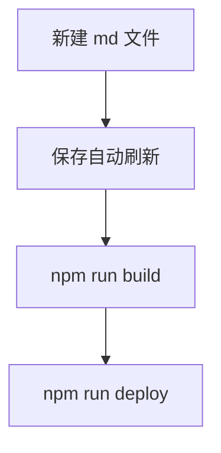

## 标题

右侧（移动端是顶部的折叠区）目录是从正文的 `##` 和 `###` 标题自动提取的，写标题时顺手把层级安排好，目录就有用了。三级标题会缩进显示在目录里。再往下的 `####` 不会进目录，但照常渲染。

## 行内格式

**加粗**、*斜体*、~~删除线~~、`行内代码`，以及[外部链接](https://github.com)（外部链接会自动新标签页打开）。

> 引用块长这样，适合放一句话的观点。
> 可以写多行，渲染在一起。

## 提示块

GitHub 风格的 `> [!NOTE]` 写法，五种类型，开箱即用：

> [!NOTE]
> 补充说明，比如前置条件、背景知识。

> [!TIP]
> 小技巧：标题层级安排好，右侧目录自动生成。

> [!IMPORTANT]
> 关键信息：`mermaid` 代码块会被渲染成图，不会被高亮。

> [!WARNING]
> 注意：分隔线 `---` 别写在文件最开头，会被当成 frontmatter。

> [!CAUTION]
> 危险操作：删 `content/` 下的文件前确认没有其他文章链它。

## 任务列表

- [x] 已完成事项
- [ ] 待办事项
- [ ] 再来一条凑数

## 表格

| 语法 | 说明 | 是否支持 |
| ---- | ---- | -------- |
| 表格 | GitHub 风格 | 支持 |
| 任务列表 | `- [ ]` | 支持 |
| 删除线 | `~~文字~~` | 支持 |

表格太宽时会自动横向滚动，不会把版面撑破。

## 代码块

```ts title="hello.ts"
// 写上语言名就有高亮，比如 ts、c、cpp、bash
function hello(name: string): string {
  return `hello, ${name}`;
}
```

```c
int main(void)
{
    int i = 6;
    if (i >= 3)
    {
        printf("hello world!\n");
    }
    return 0;
}
```

文件名两种写法：` ```ts title="hello.ts" ` 或 ` ```ts:hello.ts `，右上角可一键折叠，行号自动生成：

```bash
npm run dev      # 本地预览
npm run deploy   # 发布
```

## 脚注

正文里用 `[^1]` 引用[^1]，定义写在后面，渲染时自动沉底编号、带回跳链接[^tip]。

## Mermaid 图

用 `mermaid` 做语言名即可，支持流程图、时序图这些，主题会跟随日间 / 夜间模式自动切换：



## 分隔线

---

上面的 `---` 就是分隔线。注意它如果出现在文件最开头会被当成 frontmatter，所以分隔线前面至少要有一行正文。

[^1]: 这是第一条脚注，里面同样支持**加粗**、`行内代码`这些行内格式。
[^tip]: 脚注区样式跟正文同一套日夜变量，不用单独调。
